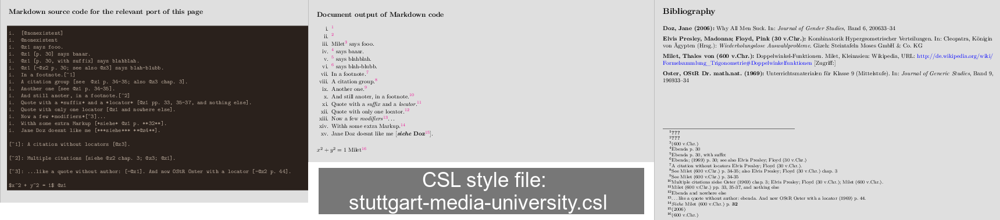

# Example Gallery

The following pictures show three parts each:

1. **Left** (identical for each picture) : the Markdown source code of the document.
1. **Center** : the formatting and contents of the document page parts containing citation references.
1. **Right** : the formatting and contents of the footnote area of the document page containing citation references.

These pictures clearly show what you can expect.

1. Some CSL-Styles do not create a bibligraphy section at all.
    Instead, they put all citation information into the page footnotes.
    Example: `thomson-reuters-legal-tax-and-accounting-australia.csl`
1. Some CSL-Styles insert snippets from the *.bib file into the document text too.
    Each CSL-Style doing so does it differently.
1. Each CSL-Style formats the bibliography section differently, and puts different parts from the *.bib file into it.

So if you see something un-expected in your document when using CSL-formatted bibliographies with it, chances are: *"It's not a bug, it's a feature."*

----

----

----

----

----

----

----

----

----

